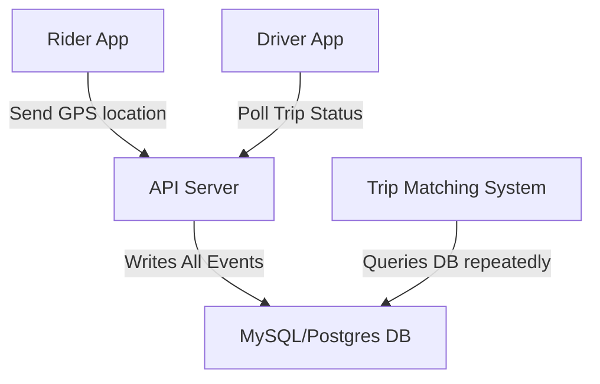
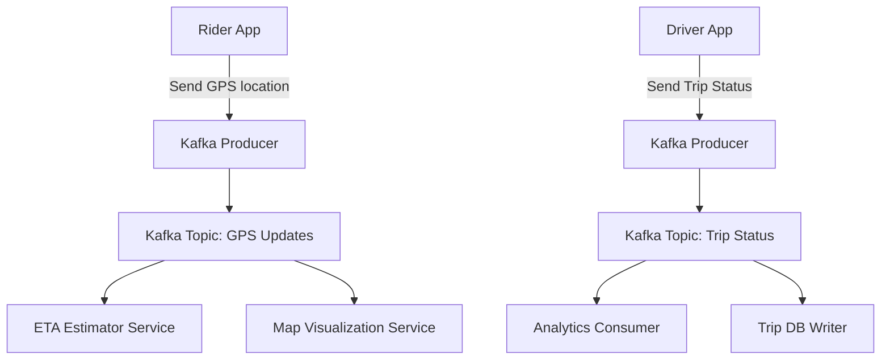

# 🚀 Let's Dive into Kafka vs Traditional DBs Using Real-Time Ride Sharing (Uber/Ola Style) as the Example

🤪 Let's gooooooooo..................................................🚨👍

## 📌 Introduction
In a real-time ride-sharing app like Uber or Ola, the backend is flooded with high-frequency events:
- Location updates from drivers and riders every few seconds.
- Trip status updates (requested, accepted, started, ended).
- Payment processing and confirmations.

If you try to run such a system using just a traditional relational database, you're inviting bottlenecks, latency, and eventual chaos. Enter **Apache Kafka**, the event-streaming powerhouse designed for real-time data firehoses.

## 💡 What is Apache Kafka?
Apache Kafka is a **distributed event streaming platform** that’s used to build **real-time data pipelines and streaming applications**. It’s designed to handle high-throughput, fault-tolerant, and low-latency workloads.

Kafka acts like a supercharged message broker:
- **Producers** send data (events) to **Kafka topics**.
- **Consumers** subscribe to those topics and process the data.
- Kafka **stores events durably**, so they can be **replayed** or processed by multiple consumers independently.

It’s battle-tested by giants like LinkedIn, Uber, Netflix, and more to manage real-time data at scale.

---

## 🏪 Traditional DB-Based Architecture

### 🔄 Flow Diagram:


### 🛠️ How It Works:
- The rider app sends GPS location data to the API server, which writes it into the DB.
- The driver app polls the trip status, and the API server fetches the relevant data from the DB.
- The trip matching system constantly queries the DB to match riders and drivers.

### 😵 Problems:
- **Write Overload**: Thousands of GPS updates every second can overwhelm the DB.
- **Polling Madness**: Clients polling every 2 seconds cause usage spikes.
- **Query Latency**: Matching logic and analytics face high latency.
- **No Fault Tolerance**: A DB crash takes everything down.
- **No Event Replay**: Once stored and deleted, it’s gone for good.

---

## ⚡ Kafka-Based Architecture

### 🔄 Flow Diagram:


### 🛠️ How It Works:
- Rider and driver apps act as Kafka producers, pushing data to Kafka topics.
- Kafka stores the data in topics like `GPS Updates` and `Trip Status`.
- Multiple services independently consume from these topics:
  - **ETA Estimator** calculates ETAs from live GPS data.
  - **Map Visualizer** updates map views in real time.
  - **Analytics** generates insights from trip statuses.
  - **DB Writer** stores essential info in a long-term database.

### 🧐 Advantages:
- **High Throughput**: Handles massive streams of events without breaking a sweat.
- **Loose Coupling**: Services don't need to know about each other.
- **Reusability**: One data stream, many use cases.
- **Event Replay**: Re-consume data anytime.
- **Scalable**: Add more consumers and partitions on the fly.

---

## 📦 Kafka + DB: The Dream Team

Kafka isn’t built for long-term storage. Here’s how to combine Kafka’s power with DB persistence:

### 🔄 Flow Diagram:
```mermaid
graph TD;
    A[Incoming Events: GPS / Trip] --> B[Kafka Topics]
    B --> C[Real-Time Services (ETA, Visualization)]
    B --> D[Kafka Consumer: DB Writer]
    D --> E[Postgres / MongoDB (Persistent Storage)]


```

### 🛠️ How It Works:
- Producers push data to Kafka.
- Real-time services consume and respond instantly.
- Dedicated consumers write to DBs for historical and audit purposes.

---

## 🔍 Real-World Example: Trip Booking Event
```json
{
  "rider_id": "R123",
  "location": "12.95,77.65",
  "timestamp": "2025-04-19T11:22:00Z",
  "type": "trip_requested"
}
```
- This event lands in Kafka’s `trip-events` topic.
- The matching system uses it to assign a driver.
- Analytics updates trip funnel metrics.
- DB writer persists it for records.

---

## 🥊 TL;DR — DB-Only vs Kafka+DB

| Feature                | DB-Only Approach             | Kafka + DB Combo                 |
|------------------------|------------------------------|----------------------------------|
| High Throughput        | 🚫 Chokes                     | ✅ Handles millions of events/sec |
| Fault Tolerance        | 🚫 Risky                      | ✅ Built-in replication            |
| Scalability            | 🚫 Vertical, expensive        | ✅ Horizontal, cheap               |
| Real-Time Processing   | 🚫 Laggy, polling hell        | ✅ Stream-based, instant           |
| Event Replay           | 🚫 No                         | ✅ Yes (by re-consuming offsets)   |
| Coupling               | 🚫 Tight                      | ✅ Loosely coupled via topics      |

---

## 🛠️ Tools to Build This:
- **Kafka**: Core event stream system.
- **Kafka Connect**: Pipes data to DBs or storage like S3.
- **Kafka Streams / Apache Flink**: For advanced stream processing.
- **Postgres / MongoDB**: Long-term storage.
- **Docker / Kubernetes**: For scalable deployments.

---

## 🔚 Conclusion
Kafka doesn’t replace databases—it **amplifies** them by handling real-time firehoses of data.

For systems like Uber or Ola, where **speed, scale, and reliability** are mission-critical, Kafka is what keeps the engine roaring without burning it out.

Ready to build it? Let’s spin up Docker and wire it all together! 🔥
